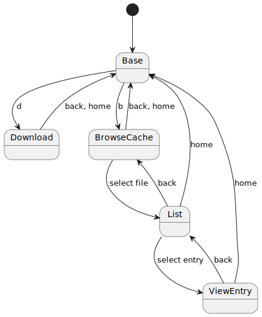
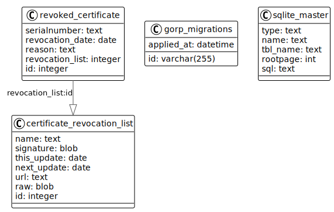

# CertGuard

 

A Terminal User Interface (TUI) for inspecting Certificate Revocation Lists (CRL's)

With CertGuard it is currently possible to:
- download & save new CRL files to the local storage 
- import locally downloaded CRL files to the local storage
- browse stored CRL's
- list entries in a CRL file
- inspect entries in a CRL file

## File locations
CertGuard uses two file locations:
- `~/.cache/certguard` location of the database/storage file
- `~/.cache/certguard/import` import directory for importing CRLs from file
- `~/.local/share/certguard` for the `debug.log` file

## States
CertGuard TUI is built with [BubbleTea](https://github.com/charmbracelet/bubbletea/tree/master) using the [Elm architecture](https://guide.elm-lang.org/architecture/).
Different screens are built using different states. Below is a statemachine depicting the state model of CertGuard:

## Storage
All information on CRL's and revoked certificates are stored on a local SQLite database. 
The Database schema used for Certguard only stores public information:

## Development
A MAKE file has been included for convenience:
- `make run` builds and run the `certguard` application in `debug` mode
- `make test` runs all unit tests
- `make lint` runs the linter 
- `make build` builds the binary file `cg`
- `make sqlc` generates the Go source files from SQL files using sqlc
- `make gif` generates the gif based on the cassette.tape using vhs

Since a TUI application cannot log to `stdout` a `debug.log` file is used for debug logging. It is located at: `~/.local/share/certguard/debug.log`
