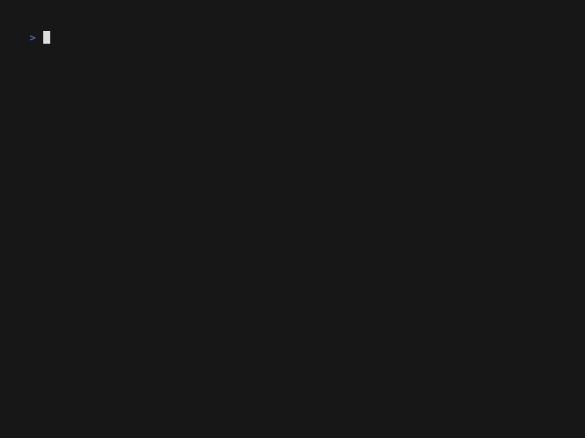
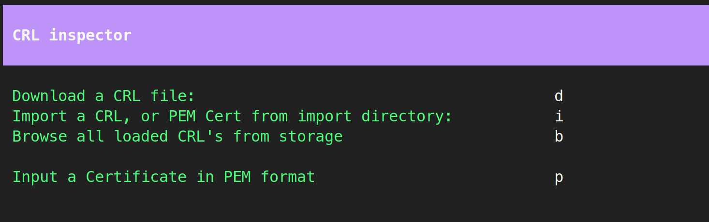
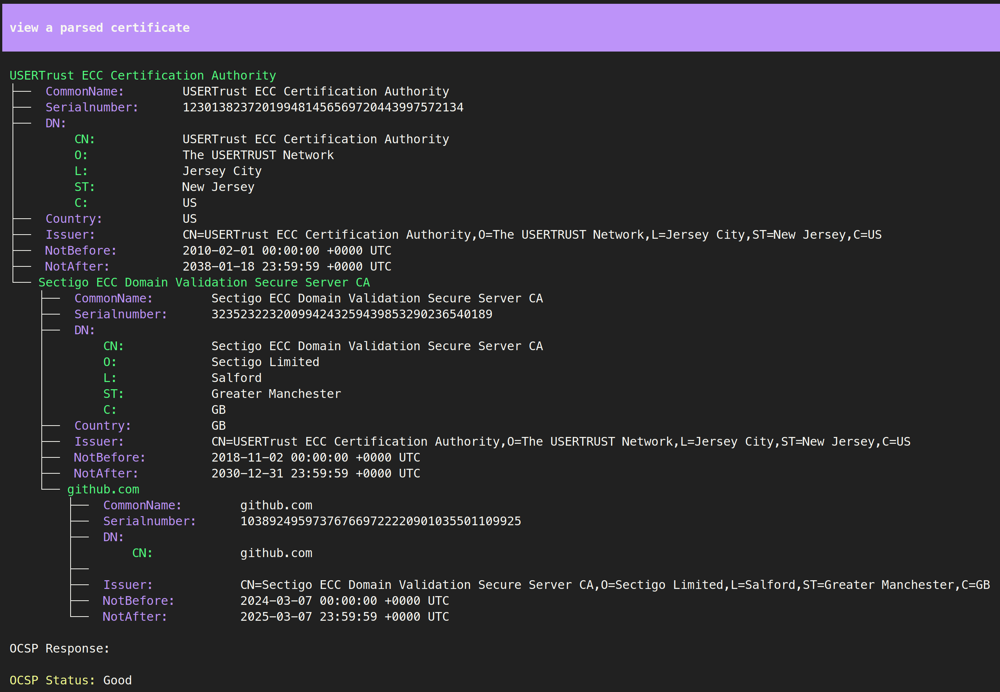
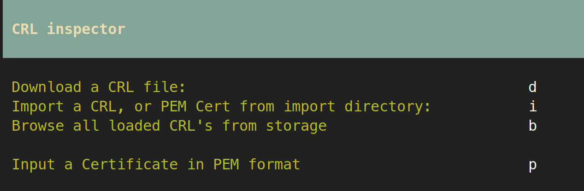
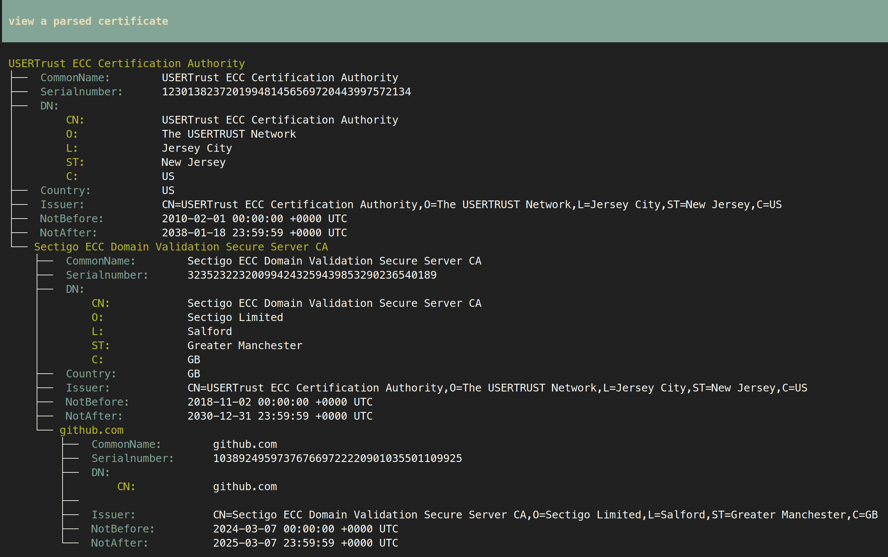
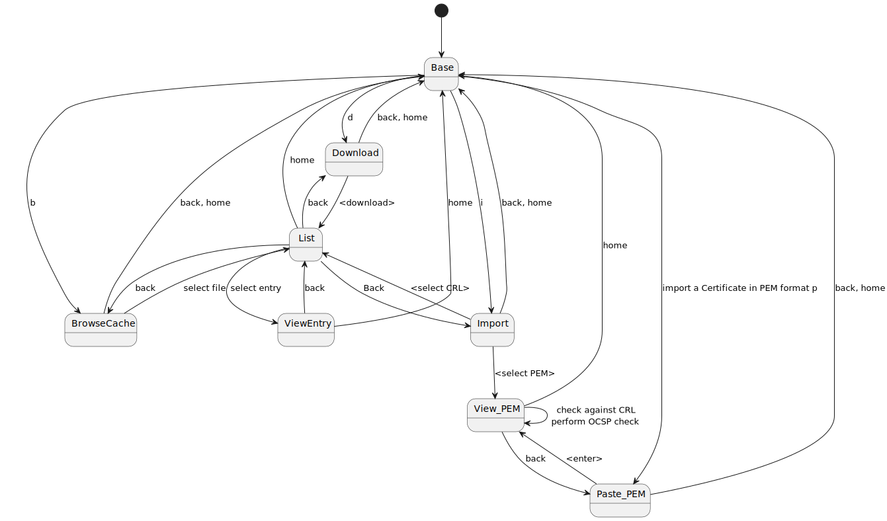
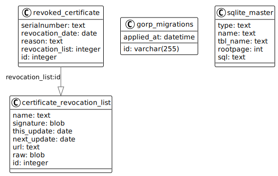

# CertGuard

 

A Terminal User Interface (TUI) for inspecting Certificate Revocation Lists (CRL's)

With CertGuard it is currently possible to:
- download & save new CRL files to the local storage 
- import locally downloaded CRL files to the local storage
- browse stored CRL's
- list entries in a CRL file
- inspect entries in a CRL file
- copy/paste certificate and certificate chains in PEM format
- import certificate and certificate chains in PEM format
- view certificates and certificate chains
- perform OCSP requests from a certificate chain

## File locations
CertGuard uses following default file locations:
- `~/.cache/certguard` location of the database/storage file
- `~/.cache/certguard/import` import directory for importing CRLs from file
- `~/.local/share/certguard` for the `debug.log` file
- `~/.config/certguard` for the `config.yaml` file

All these locations can be changed in the [config](#configuration) file.

## Themes
CertGuard has predefined themes that can be switched using the `--theme` argument. Currently supported themes are:
1. Dracula (Default)
2. Gruvbox

### Dracula

Dracula home screen

Dracula certificate view

### Gruvbox

Gruvbox home screen

Gruvbox certificate view

## States
CertGuard TUI is built with [BubbleTea](https://github.com/charmbracelet/bubbletea/tree/master) using the [Elm architecture](https://guide.elm-lang.org/architecture/).
Different screens are built using different states. Below is a statemachine depicting the state model of CertGuard:

## Storage
All information on CRL's and revoked certificates are stored on a local SQLite database. 
The Database schema used for Certguard only stores public information:

## Configuration
CertGuard can be configured using one of three ways:
1. command line flags
2. environment variables
3. config file

The precedence is `command line flags` > `environment variables` > `config file` > `defaults`

A sample config file is included in the repo: `config.yaml`
The default locations CertGuard looks for the config file are the current directory (`.`) and `$HOME/.config/certguard`

## Development
A MAKE file has been included for convenience:
- `make run` builds and run the `certguard` application in `debug` mode
- `make test` runs all unit tests
- `make lint` runs the linter 
- `make build` builds the binary file `cg`
- `make sqlc` generates the Go source files from SQL files using sqlc
- `make gif` generates the gif based on the cassette.tape using vhs

Since a TUI application cannot log to `stdout` a `debug.log` file is used for debug logging. It is located at: `~/.local/share/certguard/debug.log`
